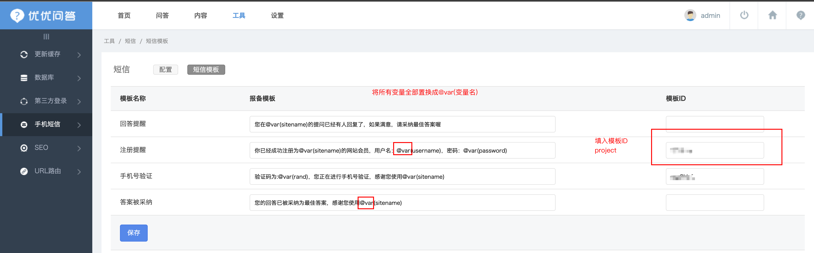

## OVERVIEW

### 优优问答系统 Plug-Ins Overview

>优优 问答系统 是一套基于PHP+MYSQL为核心开发、免费 + 开源的专业问答系统。基于THINKPHP框架开发，使用和安装及其简单，系统具执行效率高、模板自由切换、后台管理功能灵活等诸多优秀特点。
------
优优问答  [官网地址](http://www.uuask.cn/)

How to use

-	apps/Common/Common/function.php
-	tpl/Admin/default/Sms/config.html

使用方法
    本插件针对uuask版本开发，安装前请仔细核对你的系统版本。
    插件内部分文件为对系统原文件的修改，如果你的系统经过二次开发，请先核对插件文件代码，否则请直接将插件内的文件覆盖原文件。
    进入后台->工具->手机短信，填写赛邮云短信相关配置，保存即可。

[Github项目地址](https://github.com/submail-developers/uuask_sms)&nbsp;&nbsp;&nbsp;[点击下载](https://github.com/submail-developers/uuask_sms/archive/master.zip)
